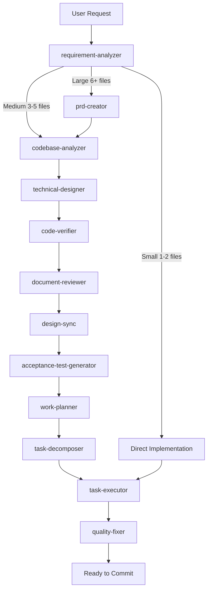
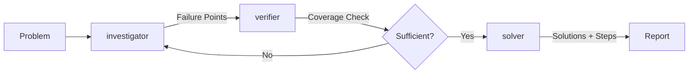

# Claude Code Workflows

[](https://claude.ai/code)
[](https://github.com/jcchikikomori/claude-workflow)
[](https://opensource.org/licenses/MIT)
[](https://github.com/jcchikikomori/claude-workflow/pulls)

End-to-end development workflows for Claude Code — specialized agents handle requirements, design, implementation, and quality checks so you get reviewable code, not just generated code.

A personal fork of [@shinpr](https://github.com/shinpr)'s [claude-code-workflows](https://github.com/shinpr/claude-code-workflows), extended with a QA plugin, env-guard, and Windows compatibility.

---

## Platform Support

| Platform | Status |
| -------- | ------ |
| macOS | Supported |
| Linux | Supported |
| WSL (Windows) | Supported |
| Native Windows | Supported |

Plugin files are copied directly — no symlinks. Full compatibility across all platforms.

---

## Quick Start

```bash
# 1. Start Claude Code
claude

# 2. Install the marketplace
/plugin marketplace add jcchikikomori/claude-workflow

# 3. Install plugins
/plugin install dev@claude-workflow
/plugin install qa@claude-workflow           # optional: QA workflows
/plugin install env-guard@claude-workflow    # optional: secrets protection

# 4. Reload plugins
/reload-plugins

# 5. Start building
/recipe-implement "Add user authentication with JWT"
```

For fullstack projects:

```bash
/recipe-fullstack-implement "Add user authentication with JWT + login form"
```

---

## Plugins

| Plugin | Category | What it provides |
| ------ | -------- | ---------------- |
| `dev` | workflow-orchestration | Agent-driven recipes for web, mobile, and integration development |
| `qa` | product-quality | Agent-driven recipes for acceptance tests, E2E, and browser-layer QA |
| `env-guard` | behavior-control | Hook enforcement to prevent leaking `.env` and secrets |
| `metronome` | behavior-control | Detects shortcut-taking and nudges Claude to proceed step by step |
| `discover` | product-quality | Turns feature ideas into evidence-backed PRDs through structured discovery |
| `caveman` | behavior-control | A plugin that makes agent talk like caveman |

The `dev` and `qa` plugins cover **workflow orchestration** — how to plan, build, and verify software using AI agents. Install the `skills` plugin from [skills-md](https://github.com/jcchikikomori/skills-md) for language/framework-specific rules (Ruby, Python, React, Node.js, Docker, etc.).

```bash
# External add-ons
/plugin install metronome@claude-workflow
/plugin install discover@claude-workflow

# Language/framework rules (from separate repo)
/plugin install skills@claude-workflow
```

---

## How It Works

### The Workflow



### The Diagnosis Workflow



### What Happens Behind the Scenes

1. **Analysis** — requirement-analyzer determines scale and picks the right workflow
2. **Codebase Understanding** — codebase-analyzer informs design decisions
3. **Planning** — technical-designer (+ ui-spec-designer for frontend) produces testable specs
4. **Execution** — task-executor / task-executor-frontend builds and tests each task
5. **Quality** — quality-fixer runs tests, fixes type errors, verifies before commit
6. **Review** — acceptance criteria trace from design through test skeletons

---

## Workflow Recipes

All workflow entry points use the `recipe-` prefix. Type `/recipe-` and use tab completion.

### Development (plugin: dev)

| Recipe | Purpose |
|--------|---------|
| `/recipe-implement` | End-to-end feature development |
| `/recipe-fullstack-implement` | End-to-end fullstack (backend + frontend) |
| `/recipe-task` | Single task with precision — bug fixes, small changes |
| `/recipe-design` | Create design documentation |
| `/recipe-plan` | Generate work plan from design doc |
| `/recipe-build` | Execute from existing task plan |
| `/recipe-fullstack-build` | Execute fullstack task plan |
| `/recipe-front-design` | Create UI Spec + frontend Design Doc |
| `/recipe-front-plan` | Generate frontend work plan |
| `/recipe-front-build` | Execute frontend task plan |
| `/recipe-front-review` | Verify frontend code against design docs |
| `/recipe-review` | Verify code against design docs |
| `/recipe-diagnose` | Investigate problems, derive solutions |
| `/recipe-reverse-engineer` | Generate PRD/Design Docs from existing code |
| `/recipe-update-doc` | Update existing design documents |
| `/recipe-generate-claude-md` | Generate a CLAUDE.md for a project |

### QA (plugin: qa)

| Recipe                           | Purpose                                      |
| -------------------------------- | -------------------------------------------- |
| `/recipe-add-integration-tests`  | Add integration/E2E tests to existing code   |
| `/recipe-web-qa`                 | Browser-layer QA on a live running web app   |

---

## Specialized Agents

### plugin-dev Agents (23)

| Agent | What It Does |
|-------|--------------|
| **requirement-analyzer** | Determines task scale and selects the right workflow |
| **codebase-analyzer** | Analyzes existing codebase to inform design |
| **prd-creator** | Writes product requirement docs for complex features |
| **technical-designer** | Plans architecture and tech stack decisions |
| **technical-designer-frontend** | Plans React component architecture and state management |
| **ui-spec-designer** | Creates UI Specifications from PRD and prototype code |
| **scope-discoverer** | Discovers functional scope from codebase for reverse engineering |
| **work-planner** | Breaks down design docs into actionable tasks |
| **task-decomposer** | Splits work into small, commit-ready chunks |
| **task-executor** | Implements backend/general features with TDD |
| **task-executor-frontend** | Implements React components with Testing Library |
| **quality-fixer** | Runs tests, fixes type errors, handles linting |
| **quality-fixer-frontend** | Handles React-specific tests, TypeScript checks, and builds |
| **code-verifier** | Validates consistency between documentation and code |
| **code-reviewer** | Checks code against design docs for completeness |
| **document-reviewer** | Reviews document quality and rule compliance |
| **design-sync** | Verifies consistency across multiple Design Docs |
| **security-reviewer** | Reviews implementation for security compliance |
| **investigator** | Maps execution paths, identifies failure points |
| **verifier** | Validates failure points using Devil's Advocate method |
| **solver** | Generates solutions with tradeoff analysis |
| **rule-advisor** | Picks the best coding rules for your current task |
| **claude-md-generator** | Generates a CLAUDE.md by analyzing project structure and stack |

### plugin-qa Agents (3)

| Agent | What It Does |
|-------|--------------|
| **acceptance-test-generator** | Creates E2E and integration test scaffolds from requirements |
| **integration-test-reviewer** | Reviews integration/E2E tests for skeleton compliance and quality |
| **web-qa-reviewer** | Browser-layer QA via Chrome DevTools — Lighthouse, console errors, network failures |

---

## Repository Structure

```text
claude-workflow/
├── .claude-plugin/
│   └── marketplace.json          # Marketplace registry
│
├── plugin-dev/                   # dev plugin — web, mobile, integrations
│   ├── agents/                   # 23 DEV agents
│   ├── skills/                   # DEV skills (recipes, coding principles, guides)
│   └── .claude-plugin/
│       └── plugin.json
│
├── plugin-qa/                    # qa plugin — web, mobile, integration testing
│   ├── agents/                   # 3 QA agents
│   ├── skills/                   # QA skills (testing principles, E2E design, recipes)
│   └── .claude-plugin/
│       └── plugin.json
│
├── plugin-env-guard/             # env-guard plugin — secrets leak prevention
│   ├── hooks/
│   │   ├── hooks.json            # PreToolUse hook registration
│   │   └── env_guard_hook.py     # Blocking script (exits 2 on sensitive path)
│   ├── skills/
│   │   └── env-guard/SKILL.md   # Behavioral guidance injected into Claude context
│   ├── agents/
│   │   └── secret-exposure-auditor.md
│   └── .claude-plugin/
│       └── plugin.json
│
├── LICENSE
└── README.md
```

Each plugin owns its agents and skills directly — no shared root directories, no symlinks.

---

## env-guard

`env-guard` prevents Claude from reading or leaking sensitive credential files (`.env`, SSH keys, cloud credentials, tokens). It works via a **PreToolUse hook** — the block happens before any tool call executes and cannot be overridden by prompt instructions.

It also ships a `secret-exposure-auditor` agent. Ask Claude to "audit for secrets" to scan a project for hardcoded keys, committed `.env` files, and `.gitignore` gaps.

```bash
/plugin install env-guard@claude-workflow
```

---

## FAQ

**Q: Which plugin should I install?**

Install `dev` for development work (backend, frontend, mobile, integrations). Install `qa` for testing workflows — acceptance test generation, integration test review, or browser-layer QA. Both can run side-by-side.

**Q: Can I use both plugins at the same time?**

Yes. The `dev` plugin handles planning, implementation, and code review; the `qa` plugin handles test generation and browser QA. When both are installed, dev recipes automatically call qa agents for test generation using the `qa-workflows:` plugin prefix.

**Q: What about frontend development?**

Frontend recipes (`/recipe-front-design`, `/recipe-front-plan`, `/recipe-front-build`, `/recipe-front-review`) are included in the `dev` plugin. No separate frontend plugin needed.

**Q: What if there are errors?**

The `quality-fixer` and `quality-fixer-frontend` agents automatically fix most issues — test failures, type errors, lint problems. If something can't be auto-fixed, you'll get clear guidance on what needs attention.

**Q: What does env-guard do and do I need it?**

It adds a security enforcement layer that blocks Claude from reading or leaking sensitive files. The block happens at the tool level before execution — it cannot be bypassed by prompt instructions. Install it alongside any other plugin.

---

## Contributing External Plugins

This marketplace supports the full lifecycle of building products with AI. If your plugin helps developers build better products with AI coding agents, see [CONTRIBUTING.md](CONTRIBUTING.md) for submission guidelines.

---

## License

MIT License — free to use, modify, and distribute.

See [LICENSE](LICENSE) for full details.

---

Built and maintained by [@jcchikikomori](https://github.com/jcchikikomori). Originally forked from [@shinpr](https://github.com/shinpr)'s [claude-code-workflows](https://github.com/shinpr/claude-code-workflows).
